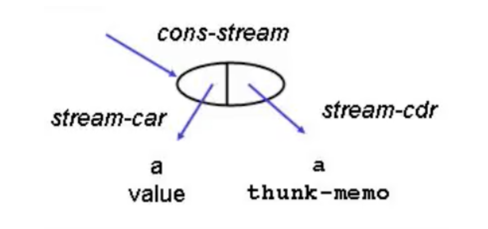

## What&Why

When you see the name *lazy evaluation*, you might wonder what is its difference from evaluation, which means running the program according to the semantics of your language. Well, lazy evaluation is a great modification to a basic evaluator. It follows the principle of laziness: delaying evaluation of procedure arguments until the last possible moment. Consider the following example from [SICP](https://mitpress.mit.edu/sites/default/files/sicp/full-text/book/book-Z-H-27.html#%_sec_4.2)

```scheme
(define (try a b)
  (if (= a 0) 1 b))
```

Using basic the evaluator in COMP524, `(try 0 (/ 1 0))` will raise an error as the denominator cannot be 0. However, with lazy evaluation, there would be no error at all! Evaluating the example would return 1, as the argument `(/ 1 0)` would never be evaluated: the evaluator promises `(/ 1 0)` to be evaluated until it is actually used. We call languages with lazy evaluation as *normal-order* languages. Also, we say a procedure is *non-strict* in an argument if the argument is not evaluated before the body of the procedure.

Another example of lazy evaluation is short-circuit evaluation

```java
false && (true || false && true)
```

As we have the logical operator *and* here, any part being evaluated to `false` will lead to the whole expression being `false`. Thus, lazy evaluation will only look at `false` and skip `(true || false && true)`.

From the above example, we can say that sometimes lazy evaluation can help reduce error, and we could save (perhaps loooong) evaluation time of an operand never needed in the body of a procedure. Popular languages like Python also integrate lots of lazy evaluation functionalities. We will see more pros and cons of lazy evaluation at the end of this post.

## Two Implementations of Lazy Evaluation

There are two implementations of lazy evaluation: *call-by-name* and *call-by-need*. Before we dive deeper into that, let's introduce a new concept called *thunk*. The idea is that, argument evaluation is going to be delayed when applying a procedure. The delayed arguments will be transformed into objects called *thunks*, which contain necessary information to produce the value of the argument. That being said, a thunk must contain the argument expression and the environment when the procedure is being called. In other words, a thunk is a shell for a delayed expression. The following list can represent a thunk

```scheme
(list 'thunk exp env)
```

Thunk is an important object in implementing lazy evaluation. The process of forming a thunk is called *freezing*, or *delay*. The process of evaluating a thunk is called *thawing*, or *forcing*. When we want to evaluate thunks, we can memoize the value of the argument, or evaluate the same thunk again in the future. This leads two different implementations of lazy evaluation, defined [here](https://academic.udayton.edu/saverioperugini/courses/cps343/lecture_notes/lazyevaluation.html) as follows:

- *call-by-name*: invokes thunk every time parameter is referenced; disadvantage: it is a waste of time when side-effects are not possible because the same value is returned each time
- *call-by-need*: records the value of each thunk the first time it is called, and thereafter refers to the saved value rather than re-invoking the thunk; this is an example of a more general technique called *memoization*, which is also used in *dynamic programming* (take COMP 550)

In other words, call-by-name is non-memoized lazy evaluation, while call-by-need is memoized lazy evaluation.

## Useful scenarios

#### Stream Object

With call-by-need, we could implement a stream abstraction. A stream object is a pair-like object, except the cdr part is not evaluated until needed. Thus, the data structure may be infinite! 

<center>
  
  <figcaption>A stream object (from <a href="https://www.youtube.com/watch?v=vAxgBQ0sA00&list=PL7BcsI5ueSNFPCEisbaoQ0kXIDX9rR5FF&index=19&ab_channel=LeonByford">here</a>)</figcaption>
</center>


Suppose we want to find the first 100 prime numbers between 1 to 100000000, without stream object, the procedure will look like

```scheme
(list-ref 
 	(filter (lambda (x) (prime? x))
          (enumerate-interval 1 100000000))
 	100)
```

This can be costly as we need to generate the entire list of integers from 1 to 100000000 before proceeding. Stream object can save us from generating a huge list. First, we define two helper procedures in generating stream objects as a list and selecting elements we want in the stream.

```scheme
;; generate a stream list, which is lazy
(define (stream-interval a b)
  (if (> a b)
      the-empty-stream
      (cons-stream a (stream-interval (+ a 1) b))))

;; filter out elements satify the predicate in stream
(define (stream-filter predicate str)
  (if (predicate (stream-car str))	
      ;; 1st elt of stream satisfies predicate. e.g., elt is a prime num
      (cons-stream (stream-car str)
                   (stream-filter predicate 
                                  (stream-cdr str)))
      (stream-filter predicate (stream-cdr str))))

;; stream-car, stream-cdr, cons-stream are procedures 
;; implementing lazy evaluation for the stream object
```

Then we have the improved version of `list-ref`

```scheme
(stream-ref 
 	(stream-filter (lambda (x) (prime? x))
                 (stream-interval 1 100000000))
 	100)
```

`stream-interval` promises to generate the numbers between 1 to 10000000, but once the first value is generated, it is immediately passed to `stream-filter`.  Then `stream-filter` will ask for the next element in the stream. The program will now go back to `stream-interval` for the second number, etc. As a consequence, we just need to find the first 100 prime numbers and exit the procedure using `stream-ref` now!


#### `yield` in Python

Here is another similar example in Python. 

We are used to writing code like `createIterable`. This can be troublesome when the list size is so large that the performance of programs may be compromised.  The keyword `yield` can solve this by following the principle of laziness. `createGenerator` will not return an actual element until it is forced to "yield" one. In other words, **when you call the function, the code you have written in the function body does not run.** Thus, `createGenerator` processes `i=0`, and takes a break until the next element in the generator is asked. Because of its laziness, what  `yield`  returns can only be used once, while an iterable list can be iterated multiple times.

```Python
# return a list as a whole
def createIterable():
	mylist = []
	for i in range(3):
		mylist.append(i*i)
	return mylist

for i in createIterable():
	print(i)	# print 0, 1, 4
  
# yield elements one by one
def createGenerator():
	mylist = range(3)
	for i in mylist:
		yield i*i

for i in createGenerator():
	print(i)	# print 0, 1, 4
```

## More about Lazy Evaluation

Pros (based on Dr. Perugini's [PL course](https://academic.udayton.edu/saverioperugini/courses/cps343/lecture_notes/lazyevaluation.html))

- saves the work required to evaluate an unused argument and sometimes prevent an error
- leads to a uniform language; no need for special syntactic forms (e.g., `if`)
- language can be extended by programmers in standard ways

Cons (based on Dr. Perugini's [PL course](https://academic.udayton.edu/saverioperugini/courses/cps343/lecture_notes/lazyevaluation.html))

- call-by-name can be inefficient if an argument is used more than once in the body (so use call-by-need version then)
- call-by-need makes a program difficult to understand in the presence of side-effects

Other applications of lazy evaluation (based on Dr. Perugini's [PL course](https://academic.udayton.edu/saverioperugini/courses/cps343/lecture_notes/lazyevaluation.html))

- *same-fringe* problem
- combinatorial search (e.g., a tree) in AI
- lends itself to straightforward implementation of important recursive algorithms (e.g. quicksort)
- overall, streams and filters are used in concert in a *genertor-filter* style of programming

Other Laziness in Computer Science

- Caching: keeping copies of data around
- DevOps: automating the deployment and maintenance cycle
- Documentation: writing great documentation about your code so that others won’t bother you